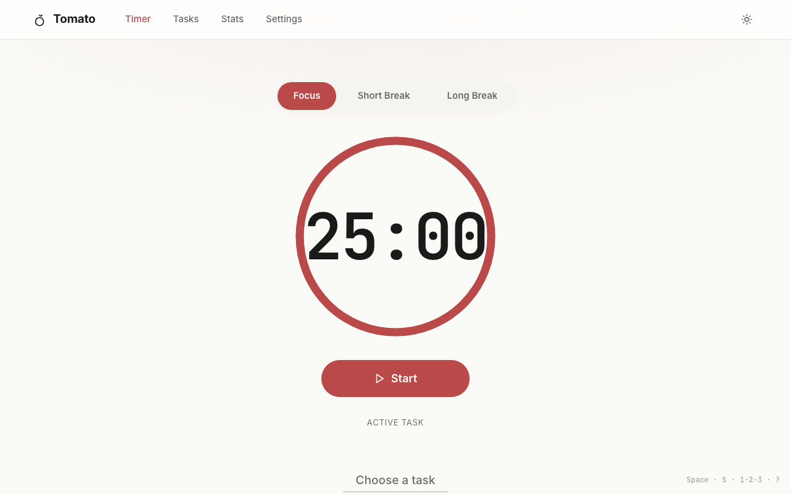

# Tomato — focus, in slices

A local-first Pomodoro PWA. Track focused time per task, watch your week take shape, and never touch a server.



---

## What it is

Tomato is a single-page Pomodoro timer that lives entirely on your device. Tasks and session history are stored in IndexedDB; settings and the running timer state survive a refresh via `localStorage`. There's no account, no sync, no telemetry.

The defining UX choice is the **phase-aware UI**: the moment a focus session starts, the whole viewport becomes the focus color (tomato red). Switch to a break and the world turns teal. The current state is unmistakable at a glance.

It installs as a PWA — desktop or mobile — and works offline.

## Features

- **Three-phase timer** with configurable durations: focus / short break / long break, plus a configurable long-break interval.
- **Tasks** with optional notes and pomodoro estimates. Link a session to a task and the time accrues per-task.
- **Stats dashboard**: today / this-week / streak scorecards, 14-day bars, 8-week trend line, and a current-week per-task donut. All rendered with Recharts.
- **Dark mode** with a `System / Light / Dark` toggle.
- **Keyboard-driven**: `Space` start/pause, `S` skip, `Esc` stop, `1·2·3` jump phases, `?` for the cheat sheet.
- **PWA**: installable, offline-capable, `theme-color` re-tints per phase. Update toast prompts a reload when a new version ships.
- **Local-first data**: export to JSON any time; clear-all is one button away with a confirm.

## Stack

| Piece | Used for |
|---|---|
| Vite + React 19 + TypeScript | Build, dev server, UI runtime |
| TanStack Router (file-based) | Routing with per-route code-splitting |
| Tailwind v4 + custom CSS | Design tokens via `@theme inline`; component visuals via ported classes from `Tomato.html` |
| shadcn-style primitives over Radix | `Button`, `Switch`, `Tabs`, `Dialog`, `Sheet`, `DropdownMenu`, `Tooltip`, `Separator` — restyled to consume design tokens |
| Dexie (IndexedDB) | Persistent task + session storage |
| Zustand (persisted) | Timer state + settings, with `localStorage` rehydration |
| Recharts | Stats charts, themed against the same `--accent` tokens |
| vite-plugin-pwa + Workbox | Service worker, manifest, install / update flows |
| Sonner | Toasts (completion + update-ready) |
| Lucide React | Icons |
| date-fns | Day / week bucketing for stats |

## Local development

Requires **Node ≥ 20** and **pnpm**.

```bash
pnpm install        # install deps (esbuild build scripts are pre-approved)
pnpm dev            # dev server on http://localhost:5173
pnpm build          # tsc -b && vite build → dist/
pnpm preview        # serve dist/ on http://localhost:4173
pnpm lint           # tsc --noEmit (no ESLint yet)
```

The first `pnpm dev` run also generates `src/routeTree.gen.ts` via the TanStack Router Vite plugin. That file is gitignored.

## Project structure

```
src/
├── main.tsx              # Router + StrictMode bootstrap
├── routes/               # File-based routes (TanStack)
│   ├── __root.tsx        # AppShell: nav, fullbleed toggle, global hooks, toasts
│   ├── index.tsx         # / Timer
│   ├── tasks.tsx
│   ├── stats.tsx
│   └── settings.tsx
├── components/
│   ├── ui/               # shadcn-style primitives (Radix under the hood)
│   ├── layout/           # TopNav, BottomTabBar, Brand, ThemeToggle, OfflineChip
│   ├── timer/            # PhaseTabs, TimerRing (SVG), TimerControls, ActiveTaskPicker, TodayRow
│   ├── tasks/            # TaskAddRow, TaskFilters, TaskCard, TaskEditSheet, TaskEmpty
│   ├── stats/            # StatScoreCards, DailyBarsChart, WeeklyTrendChart, PerTaskDonut, StatsEmpty
│   ├── settings/         # Stepper, SettingRow, ThemeRadio, DataActions
│   ├── pwa/              # InstallPrompt
│   └── ShortcutSheet.tsx # ? cheat sheet
├── db/                   # Dexie schema + query helpers (tasks, sessions, rollups)
├── stores/               # Zustand stores: timer-store, settings-store (both persisted)
├── hooks/                # use-timer (heartbeat + remaining), use-phase, use-theme,
│                         #   use-notifications, use-keyboard-shortcuts, use-pwa-update, use-online
├── lib/                  # cn, time, audio (WebAudio chime), uuid
└── styles/
    ├── index.css         # tailwind import + @theme bridge to design tokens
    ├── tokens.css        # design tokens + light/dark + [data-phase=…] re-tinting
    ├── base.css          # reset, body radial gradient, .site / .mono / focus rings
    └── components.css    # all design component classes (.topnav, .tcard, .heroring, …)
```

## Data model

From `src/db/dexie.ts`:

```ts
export type Phase = "focus" | "short" | "long";

export interface Task {
  id: string;
  title: string;
  notes?: string;
  estimatedPomodoros?: number;
  createdAt: number;
  archivedAt?: number;
}

export interface Session {
  id: string;
  taskId?: string;
  type: Phase;
  startedAt: number;
  endedAt: number;
  plannedDurationMs: number;
  actualDurationMs: number;
  completed: boolean;
}
```

Indexes: `tasks: id, createdAt, archivedAt` · `sessions: id, taskId, startedAt, [type+startedAt]`.

Tasks are soft-deleted via `archivedAt` so historical sessions keep their link. Per-task totals and daily/weekly rollups are computed on demand in `src/db/sessions.ts` (no denormalized counters).

## Keyboard shortcuts

Active everywhere except when you're typing in a form field.

| Key | Action |
|---|---|
| `Space` | Start, pause, or resume the timer |
| `S` | Skip the current phase |
| `Esc` | Stop and discard the current session (with confirm) |
| `1` / `2` / `3` | Jump to Focus / Short Break / Long Break |
| `?` | Open the shortcut cheat sheet |

Implemented in `src/hooks/use-keyboard-shortcuts.ts`.

## PWA behavior

- **Offline**: Workbox precaches the app shell + fonts. IndexedDB writes work offline. The top nav shows an `Offline · saving locally` chip when `navigator.onLine` flips to false.
- **Install**: `InstallPrompt` (`src/components/pwa/InstallPrompt.tsx`) catches `beforeinstallprompt`, presents the install card, and respects a 14-day "not now" dismissal stored in `localStorage`.
- **Updates**: `usePwaUpdate` (`src/hooks/use-pwa-update.ts`) registers via `workbox-window` and surfaces a Sonner toast with a `Reload` action when a new service worker is waiting.
- **Theme color**: `meta[name="theme-color"]` is rewritten by `use-phase` whenever the timer phase changes, so the browser chrome (Android status bar, iOS standalone bar) re-tints in lockstep with the UI.

## Files in this repo

| File | Role |
|---|---|
| `README.md` | This file. |
| `PLAN.md` | The original scaffold contract — stack, routes, data model, setup steps. Treat as the functional north star. |
| `DESIGN.md` | The visual / brand specification — principles, color system, motion, component patterns, page designs, a11y. |
| `docs/preview.png` | Light-mode Timer screenshot used at the top of this README. |

## License

MIT — or whatever you choose. Add a `LICENSE` file if you publish.
